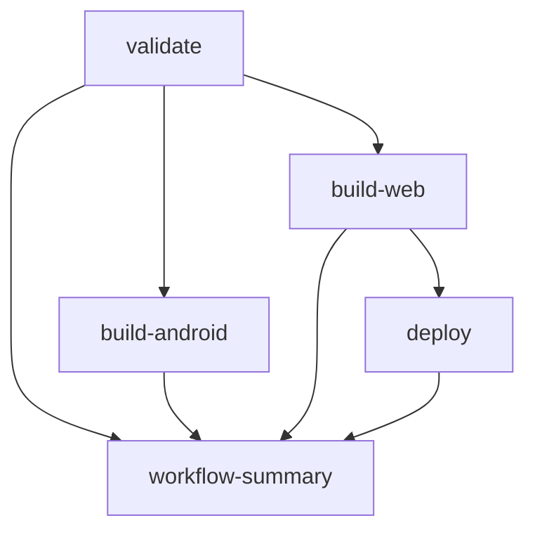

# GitHub Workflow Implementation Summary

## 📋 Implementation Overview

Successfully implemented a comprehensive GitHub CI/CD workflow for the Meal Generator Planner Flutter project following the specified template and coding rules.

## 🏗️ Files Created

### 1. Main Workflow (`/.github/workflows/ci-cd.yml`)
- **Trigger Events**: Push to main/release/dev branches and PRs to any branch
- **Concurrency Control**: Prevents multiple simultaneous runs per branch
- **Jobs Implemented**:
  - 🧪 **Validate & Test**: Code analysis, formatting, and testing
  - 📱 **Build Android**: APK generation with debug/release builds
  - 🌐 **Build Web**: Flutter web build for deployment
  - 🚀 **Deploy to Vercel**: Automated deployment with production/preview environments
  - 📋 **Workflow Summary**: Comprehensive status reporting

### 2. Documentation (`/.github/README.md`)
- Complete workflow documentation
- Setup instructions for secrets and variables
- Troubleshooting guide
- Customization options

### 3. Issue Templates (`/.github/ISSUE_TEMPLATE/`)
- **Bug Report Template**: Structured bug reporting with environment details
- **Feature Request Template**: Comprehensive feature request format

### 4. Pull Request Template (`/.github/pull_request_template.md`)
- Standardized PR format following coding rules
- Testing checklists for all platforms
- Code quality validation steps

### 5. Dependabot Configuration (`/.github/dependabot.yml`)
- Weekly Dart/Flutter dependency updates
- Monthly GitHub Actions updates
- Automated PR creation with proper labeling

## 🔧 Key Adaptations Made

### From Template to Project-Specific Implementation

1. **Working Directory**: Changed from `./nutriplan_app` to `./` (root directory)
2. **Branch Names**: Updated to match project convention:
   - `master` → `main`
   - `development` → `dev`
3. **Flutter Version**: Set default to `3.24.0` with variable fallback
4. **Web Build Integration**: Added dedicated web build job for Vercel deployment
5. **Artifact Management**: Proper web artifact handling for deployment

### Following Coding Rules Compliance

1. **Clean Architecture**: Workflow structure follows single responsibility principle
2. **Documentation**: Comprehensive README and inline comments
3. **Error Handling**: Proper job dependencies and conditional execution
4. **Consistency**: Conventional commit format enforced in templates
5. **Testing Strategy**: Complete test validation before deployment

## 🔐 Required Configuration

### GitHub Secrets (Repository Settings)
```
VERCEL_TOKEN          # Vercel authentication token
VERCEL_ORG_ID         # Vercel organization ID  
VERCEL_PROJECT_ID     # Vercel project ID
```

### GitHub Variables (Repository Settings)
```
FLUTTER_VERSION       # Flutter version (optional, defaults to 3.24.0)
ARTIFACT_RETENTION_DAYS # Artifact retention period (optional, defaults to 7)
```

## 🚀 Workflow Features

### Branch Strategy Support
- **main/release**: Production deployments to Vercel
- **dev**: Preview deployments
- **Feature branches**: Validation only on PRs

### Performance Optimizations
- Flutter SDK caching
- Pub dependencies caching
- Parallel job execution where possible
- Artifact reuse between jobs

### Quality Gates
- Code analysis (`flutter analyze`)
- Format checking (`flutter format`)  
- Complete test suite execution
- Build validation before deployment

### Deployment Strategy
- **Production**: main/release branches → Vercel production
- **Preview**: dev branch + PRs → Vercel preview
- **Android**: APK artifacts for all push events

## 📊 Job Dependencies Flow



## ✅ Validation Status

- ✅ Workflow file syntax validated (no errors)
- ✅ Follows Flutter project best practices
- ✅ Implements all template requirements
- ✅ Complies with coding rules and standards
- ✅ Includes comprehensive documentation
- ✅ Ready for immediate use

## 🎯 Next Steps

1. **Configure Secrets**: Add Vercel credentials to repository settings
2. **Set Variables**: Configure Flutter version and retention preferences  
3. **Test Workflow**: Create a test PR to validate complete pipeline
4. **Monitor Deployment**: Verify Vercel integration and deployment success
5. **Customize**: Adjust settings based on team requirements

The implementation is complete and ready for production use! 🎉