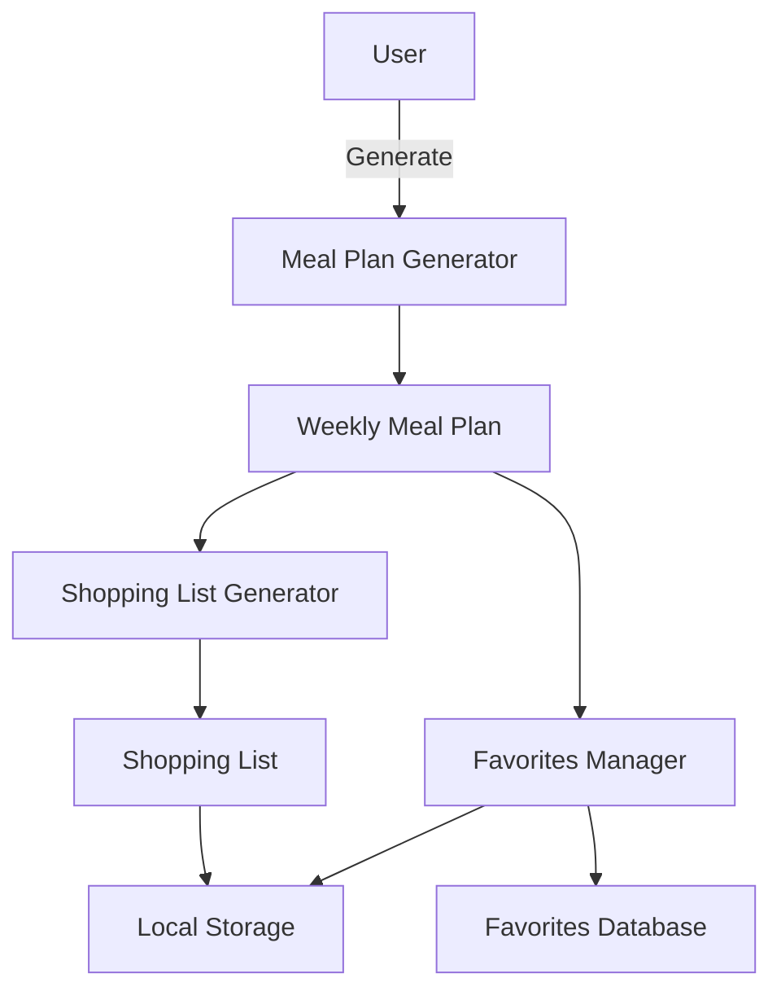

# Product Requirements Document (PRD) - Meal Generator Planner

## 1. Overview
The **Meal Generator Planner** is a simple, offline-first meal planning tool designed primarily for housewives and households. The app generates meal plans, allows manual customization, and produces shopping lists. It does not require login or sensitive data storage, ensuring simplicity and privacy. 

Supported Platforms: **Web (PWA)** and **Android (APK)**.  
Codebase: **Single codebase using Flutter/Dart**.

---

## 2. Goals & Objectives
- Provide an intuitive and minimal interface for planning meals.
- Support weekly meal generation with customization options.
- Generate shopping lists automatically based on planned meals.
- Ensure offline usability with local storage.
- Deliver lightweight, fast, and accessible user experience.

---

## 3. Target Audience
- Housewives and parents managing family meals.
- Small households aiming to reduce food waste and streamline planning.
- Users preferring apps without login/complex setup.

---

## 4. Core Features

### 4.1 Meal Plan Generation
- Generate weekly meal plans (breakfast, lunch, dinner, snacks).
- Criteria: avoid repetitions, ensure variety.
- Filters (optional for future): vegetarian, calorie-conscious.

### 4.2 Manual Customization
- Swap or replace meals within a plan.
- Add/edit/remove custom meals.

### 4.3 Shopping List
- Auto-generate based on current plan.
- Group items by category (vegetables, proteins, etc.).
- Checkbox support for marking items as purchased.

### 4.4 Favorites
- Save frequently used meals.
- Pin favorites for guaranteed inclusion in future plans.

### 4.5 Offline-first Support
- Data stored locally (Hive DB for Flutter).
- No login, no cloud dependency.

---

## 5. Non-Goals
- No social features (sharing, community recipes).
- No real-time cloud sync in MVP.
- No nutritional breakdown beyond simple calorie count.

---

## 6. Functional Requirements

### 6.1 User Stories
1. As a housewife, I want to generate a meal plan with one click so I can save time.  
2. As a user, I want to replace meals in the plan so it fits my family’s preferences.  
3. As a user, I want an automatically generated shopping list so I can shop efficiently.  
4. As a user, I want to save favorite meals so they appear in future plans.  
5. As a user, I want to use the app offline so I can access it anytime.  

### 6.2 Use Cases
- **UC1:** Generate a meal plan → Save locally.  
- **UC2:** Edit plan → Replace specific meals → Save updated plan.  
- **UC3:** Create shopping list → Check items → Export (future).  
- **UC4:** Save meal as favorite → Pin for future plans.  

---

## 7. User Experience & Design

### 7.1 UX Principles
- Large buttons for easy navigation.
- Minimal input required.
- Simple calendar view of meal plans.
- Intuitive navigation: Home → Meal Plan → Shopping List → Favorites.

### 7.2 Key Screens
1. **Home Dashboard**: Quick “Generate Plan” button.  
2. **Meal Plan**: Weekly view with editable meal slots.  
3. **Shopping List**: Checklist view grouped by food category.  
4. **Favorites**: Saved meals with quick add option.  

---

## 8. Technical Constraints
- Single codebase (Flutter/Dart).
- Offline-first architecture.
- Local storage only (Hive).
- No login/authentication.

---

## 9. Success Metrics
- Time to generate a plan < 1 second.
- 80% of users complete weekly plan creation within 2 clicks.  
- App size < 20MB.  
- >90% crash-free sessions.

---

## 10. Risks & Mitigations
- **Risk:** Limited meal dataset → User dissatisfaction.  
  **Mitigation:** Allow custom meal entry.  
- **Risk:** User drops app if UI is too complex.  
  **Mitigation:** Prioritize simplicity, minimal input steps.  
- **Risk:** Storage corruption in local DB.  
  **Mitigation:** Use robust Hive DB with backup/export option (future).  

---

## 11. Future Roadmap
- Export shopping list as PDF/Excel.  
- Recipe API integration for broader content.  
- Multi-language support.  
- Notifications/reminders for meal prep.  

---

## 12. Diagram

